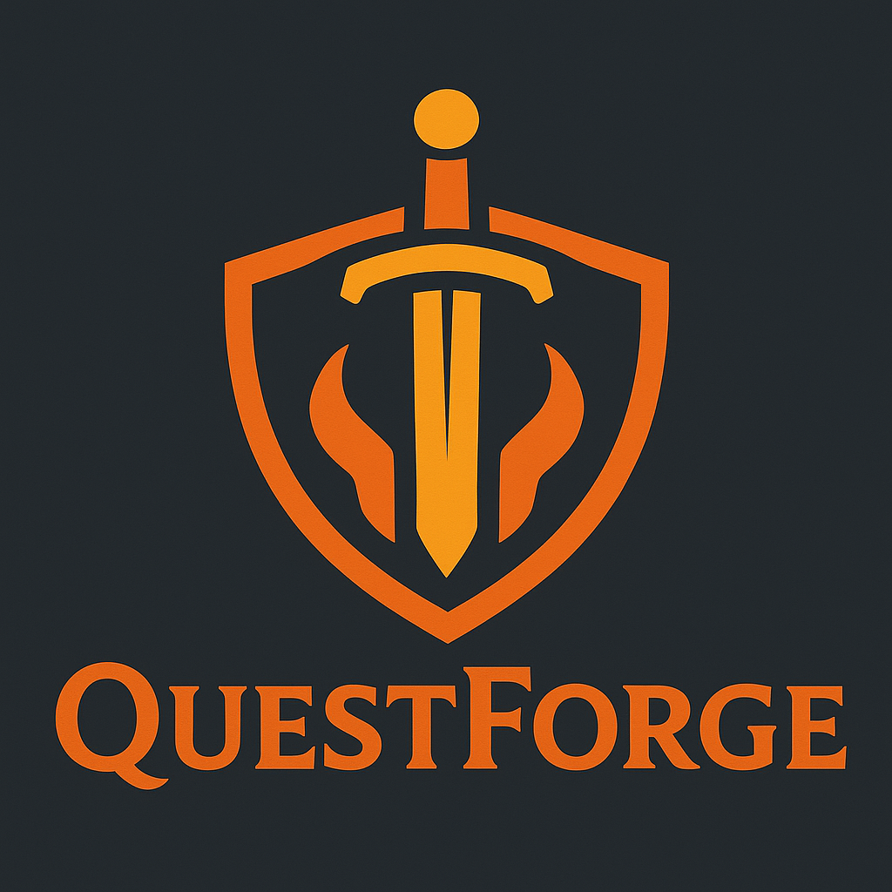
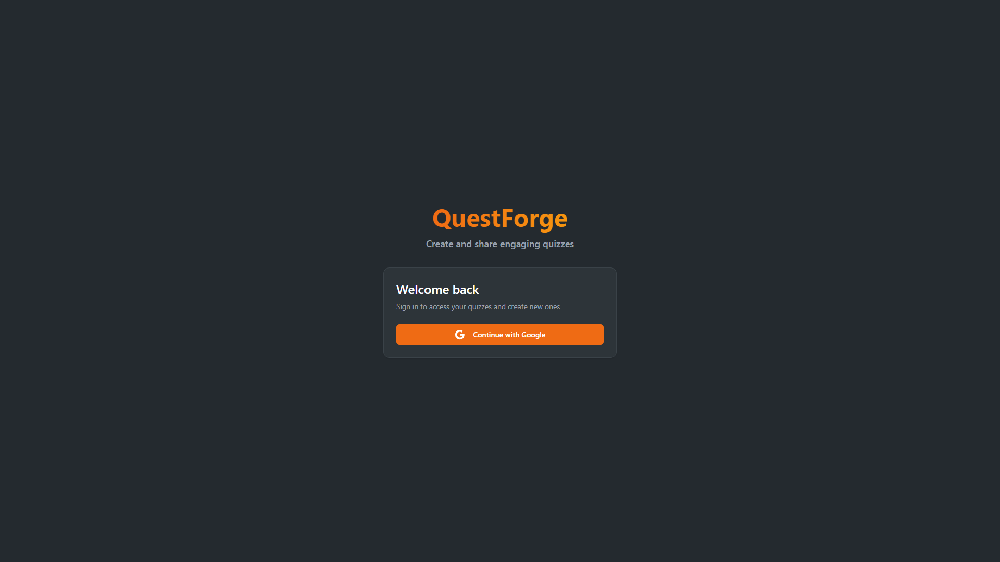
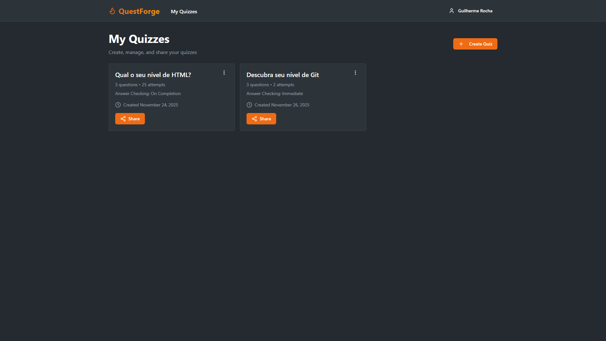
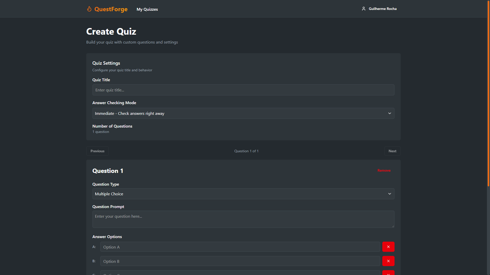
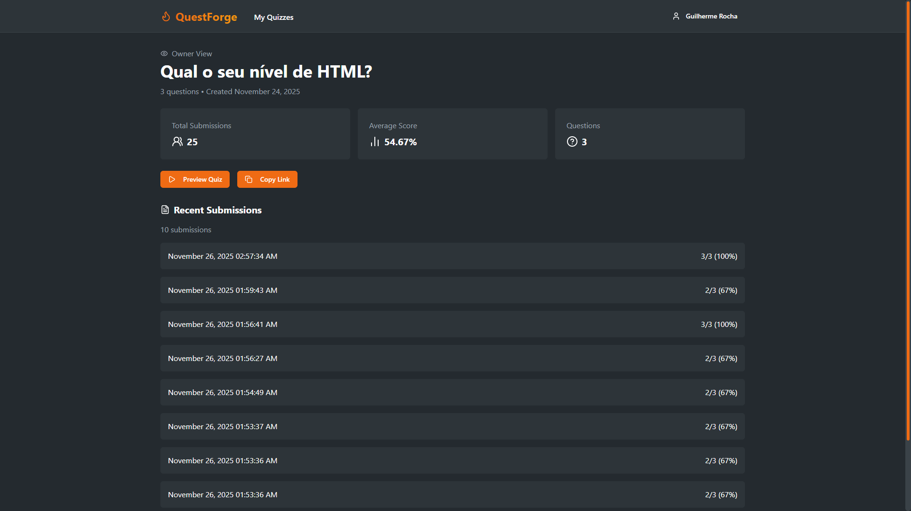
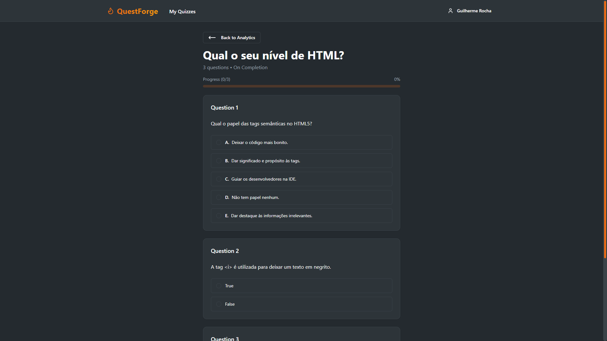
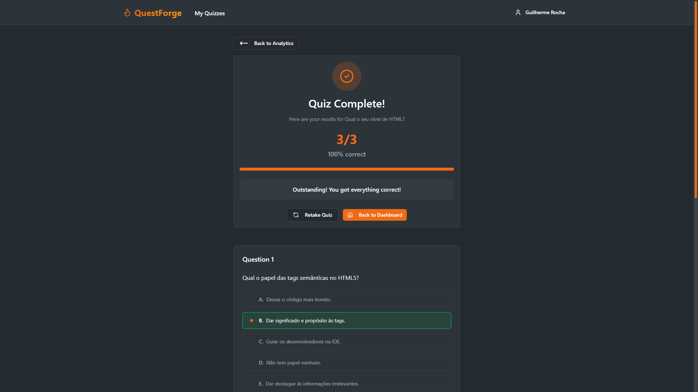

# QuestForge

QuestForge is a modern quiz-creation platform that allows users to create, manage, and share engaging quizzes. With features like multiple question types, customizable settings, and real-time results, QuestForge makes quiz creation simple and fun.

---

## Features

### Authentication

- **Sign In with Google**: Securely log in to access your quizzes and create new ones.
- **Redirect to Dashboard**: Automatically navigate to your dashboard after signing in.



---

### Dashboard

- **My Quizzes**: View and manage all your quizzes in one place.
- **Create New Quiz**: Start building a new quiz with a single click.



---

### Quiz Creation

- **New Quiz**: Add a title, choose answer-checking modes, and create questions.
- **Question Types**: Choose between true-false, open-ended and multiple-choice questions (A–E).
- **Customizable Options**: Add explanations, correct answers, and more.



---

### Quiz Management

- **View Quiz**: Access detailed analytics for your quiz, including total submissions and average scores.
- **Edit Quiz**: Modify quiz settings and questions anytime.
- **Shareable Link**: Copy a public link to share your quiz with others.



---

### Quiz Taking

- **Answer Quiz**: Participants can answer questions in real-time.
- **Answer Checking Modes**:
  - **Immediate**: Show correctness after each question.
  - **On-Submit**: Display results only after the quiz is submitted.



---

### Quiz Results

- **Results Summary**: See total correct answers, percentage scores, and feedback messages.
- **Retake Quiz**: Allow participants to retry the quiz for better results.



---

## Technology

QuestForge is built with modern technologies to ensure a seamless and efficient experience.

**Stack:** React, Next.js, TypeScript, Tailwind CSS, Supabase, React Hook Form + Zod, Sonner, UUID, Date FNS.

---

## Getting Started

### Prerequisites

- Node.js
- npm or yarn

### Installation

1. Clone the repository:
   ```bash
   git clone https://github.com/guilhermescr/questforge.git
   ```
2. Navigate to the project directory:
   ```bash
   cd questforge
   ```
3. Install dependencies:
   ```bash
   npm install
   ```
4. Create a `.env` file with your Supabase credentials:
   ```env
   NEXT_PUBLIC_BASE_URL=your-url.here
   NEXT_PUBLIC_SUPABASE_URL=your-supabase-url
   NEXT_PUBLIC_SUPABASE_ANON_KEY=your-supabase-anon-key
   ```
5. Start the development server:
   ```bash
   npm run dev
   ```

---

## Screenshots

### Authentication Page


### Dashboard


### New Quiz


### View Quiz


### Answer Quiz


### Quiz Results


---

## Links

- **Live Demo**: [https://questforge-app.vercel.app/auth](https://questforge.vercel.app/auth)
- **Repository**: [https://github.com/guilhermescr/questforge](https://github.com/guilhermescr/questforge)

---

## Reporting Issues

If you encounter any critical bugs or security vulnerabilities, please contact me directly at **devguiga@gmail.com**. Your feedback is highly appreciated and helps improve the platform!

---

## Authors

- **Guilherme Rocha**  
  Follow me on [GitHub](https://github.com/guilhermescr) and join the community!  
  Thank you for visiting, and happy quiz forging!
